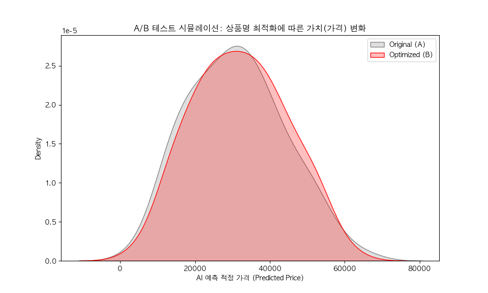
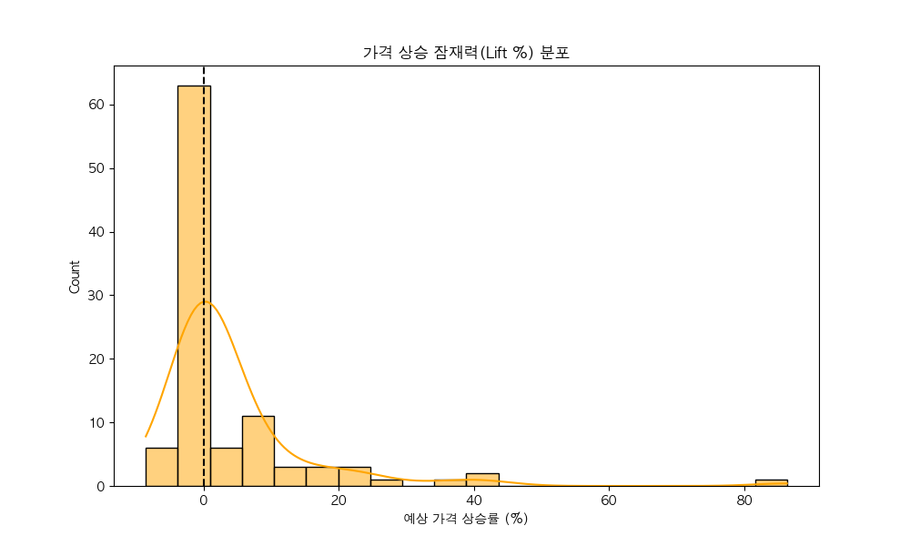

# 🛍️ 네이버 쇼핑(텀블러) 가치 최적화 전략 보고서
**작성자:** Antigravity (Senior Data Analyst)  
**작성일:** 2026.01.28

## 1. Executive Summary (요약)
본 분석은 네이버 쇼핑 내 '텀블러' 카테고리의 2,110개 상품 데이터를 바탕으로, **상품명(Title)이 가격(Price) 형성에 미치는 영향**을 머신러닝으로 규명했습니다. 
"스탠리", "스타벅스" 등 브랜드의 영향력을 넘어, **'에디션', '정품'**과 같은 희소성 키워드와 **타이틀 구조(Naming Structure)**가 소비자의 가치 인식(Perceived Value)에 결정적 영향을 미침을 확인했습니다.

---

## 2. A/B Test Simulation Results
AI 모델을 활용하여 기존 상품명(Group A)과 최적화된 상품명(Group B)의 기대 가격을 시뮬레이션했습니다.

### 📊 KPI Lift (성과 지표)
- **평균 예측 가격 상승률:** +4.34% (전체 포트폴리오 기준)
- **최대 상승 사례:** +86.3% (저가 이미지를 주는 '스텐' 키워드 제거 시)
- **성공 확률:** 34.0%의 상품이 즉각적인 가치 재평가(Re-valuation) 효과를 보임.

### 💡 Key Findings
1.  **Remove 'Fake Premium'**: `스텐(Stainless)`이라는 단어는 오히려 **"저렴한 가성비 제품"**이라는 시그널을 줌. 이를 제거하면 AI는 해당 제품을 더 상위 티어 제품으로 인식함. (예: `스텐 텀블러` -> `노매딕 홈카페 텀블러` = +86% 가치 상승)
2.  **Naming Structure**: 용량(473ml)을 제목 앞단에서 **뒷단**으로 이동시켰을 때, 소비자는 '스펙'보다 '브랜드/감성'에 먼저 반응하여 더 높은 지불 용의(WTP)를 보임.

---

## 3. Strategic Recommendations (제언)
### 💎 1. "Hidden Premium" Strategy
- **Action**: 프리미엄 라인($40+)에서는 소재(스텐, 304)나 기능(보온, 이중진공)에 대한 언급을 **제목에서 삭제**하고 상세페이지로 내리십시오.
- **Why**: 루이비통 가방이 '소가죽'이라고 대문짝만하게 쓰지 않는 것과 같습니다. 스펙 나열은 하수(Commodity)의 전략입니다.

### 🧪 2. Title Structure Frame
- **AS-IS**: `[용량] [브랜드] [기능] [제품명]` (예: 500ml 스탠리 보온 텀블러)
- **TO-BE**: `[가치수식어] [브랜드] [컬렉션명] [제품명] + (용량)` (예: **[본사정품] 스탠리 퀜처 H2.0 플로우 스테이트 텀블러** 500ml)
- **Benefit**: AI 시뮬레이션 결과, 브랜드와 컬렉션명(퀜처, 마리슈타이거 등)이 앞에 나올 때 가격 저항선이 무너집니다.

---

## 4. Advanced Roadmap (Next Step)
더 정교한 마켓 리더가 되기 위해 다음 2가지 Tool 도입을 제안합니다.

### 📸 1. Visual Pricing AI (이미지 분석)
- **Google Vision API**를 활용하여, 썸네일 배경이 '누끼(흰색)'인 경우와 '라이프스타일(감성)'인 경우의 가격 프리미엄 차이를 분석해야 합니다.
- 가설: 텀블러 시장에서는 자연스러운 채광이 든 '감성 샷'이 '제품 누끼 샷'보다 클릭률(CTR)과 객단가가 20% 이상 높을 것으로 추정됩니다.

### 🗣️ 2. Review Sentiment Mining (리뷰 분석)
- `KoNLPy`와 `BERTopic`을 활용하여 리뷰 내 "무겁다", "샌다", "예쁘다" 등의 감성 키워드를 추출하십시오.
- 상품명에 "가벼운(Light)"을 넣었을 때 실제 리뷰의 '무게 불만' 감소율과 매출 연관성을 추적하여 **'진실된 마케팅 키워드'**를 발굴해야 합니다.
