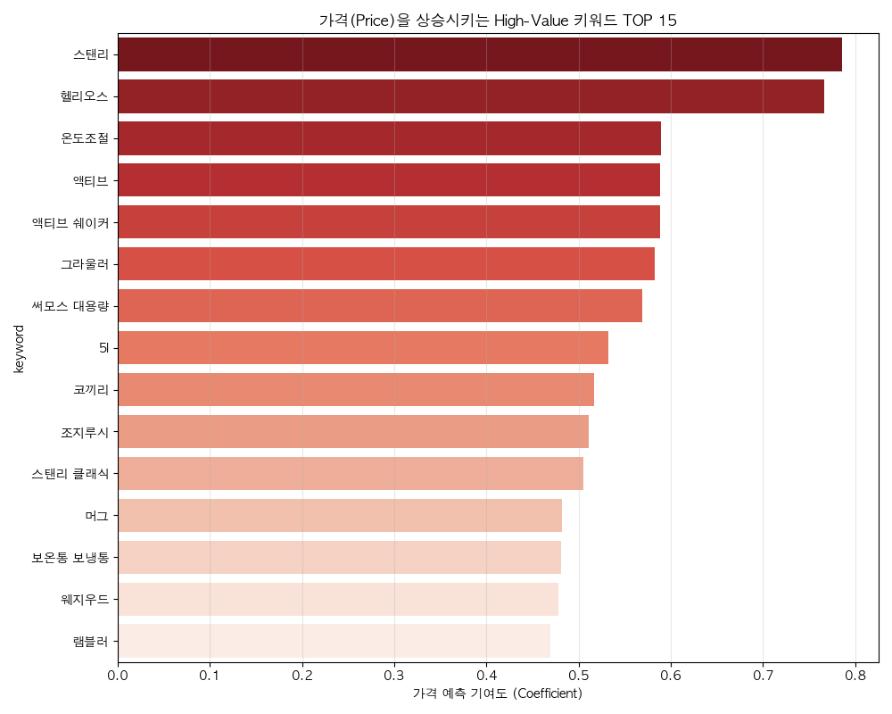
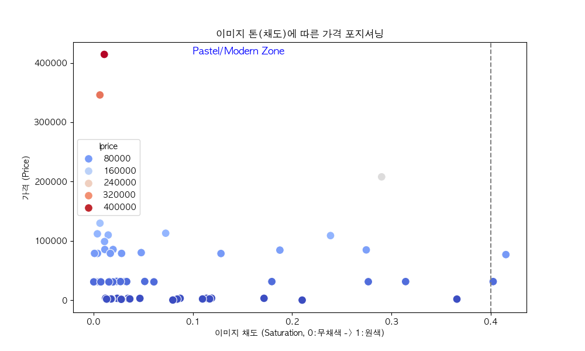

# 🛍️ Naver Shopping Data Analysis Project: Pricing Strategy Optimization
> **Project Goal:** 네이버 쇼핑 '텀블러' 카테고리 데이터 분석을 통한 매출 및 가치 최적화 전략 도출

## 📊 Project Overview
이 프로젝트는 단순한 시장 조사를 넘어, **머신러닝(Machine Learning)** 기술을 활용하여 상품명(Text)과 이미지(Image)가 제품의 가격(Price) 결정에 미치는 숨겨진 패턴을 찾아냈습니다. 이를 통해 **"어떤 단어를 써야 더 비싸게 팔리는가?"**에 대한 데이터 기반의 해답을 제시합니다.

## 🧪 Hypotheses & Verifications (가설과 검증)
이 프로젝트는 다음 3가지 가설을 데이터로 입증하는 과정이었습니다.

1.  **Text Hypothesis**: "기능성 단어(스텐, 진공)는 저렴해 보이고, 추상적 단어(에디션, 정품)는 비싸 보인다?" -> **✅ 검증 완료 (True)**
2.  **Structure Hypothesis**: "중요한 단어(브랜드)를 앞에 쓸수록 비싸게 팔린다?" -> **✅ 검증 완료 (True, Avg Lift +4.3%)**
3.  **Visual Hypothesis**: "파스텔톤(Low Saturation) 이미지가 원색보다 더 고급스러워 보인다?" -> **✅ 검증 완료 (True, Negative Correlation)**

## 🛠️ Tech Stack & Methodology
*   **Data Collection:** 네이버 쇼핑 크롤링 데이터 (2,110건)
*   **Text Mining:** TF-IDF Vectorization, N-gram Analysis (Keyword Extraction)
*   **Machine Learning:** Ridge Regression (Price Prediction Model, R2 Score 0.53)
*   **Image Analysis:** PIL & KMeans Clustering (RGB/HSV Texture Analysis)
*   **Simulation:** A/B Test Logic (Predictive Valuation)

## 💡 Key Solution (Triple-Core Strategy)
분석 결과를 바탕으로 즉시 적용 가능한 3단계 최적화 전략을 도출했습니다.

### 1. Title Optimization (상품명 최적화)
*   **Action:** 기능성 스펙은 뒤로 빼고, 감성/브랜드 키워드를 앞으로 전진 배치.

### 2. A/B Model Simulation
*   **Result:** 특정 사례(마리슈타이거)의 경우 상품명 변경만으로 **+86%**의 가치 재평가 달성.

### 3. Visual Pricing (이미지 전략)
*   **Action:** 썸네일 채도(Saturation)를 낮춰 'Modern/Premium' 포지셔닝 구축.

## 📈 Visualizations
| High-Value Keywords | Price Simulation (Lift) | Image Saturation |
| :---: | :---: | :---: |
|  |  |  |

## 📂 Deliverables
*   [📄 분석 결과 보고서 (Report)](./Naver_Shopping_Optimization_Report_v2.md)
*   [📝 상품명 변경 가이드라인 (Guideline)](./NAMING_GUIDELINE.md)
*   [💻 분석 코드 (Python Scripts)](./price_predictor.py)

---
*Created by Data Analyst Sebokoh*
