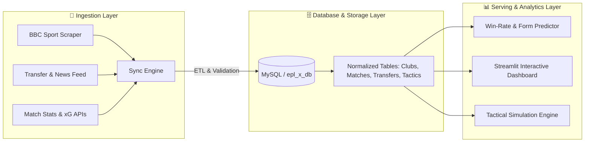

# ⚽ EPL Real-Time Data Pipeline & Analytics Engine
> **End-to-End Sports Data Engineering & Predictive Analytics Platform**  
> An automated pipeline for ingesting Premier League match statistics, transfer updates, and tactical metrics into MySQL, powering interactive dashboards and match outcome simulations.


---

## 📌 Architecture Overview


```mermaid
flowchart LR
    subgraph Ingestion["📡 Ingestion Layer"]
        A[BBC Sport Scraper] --> E[Sync Engine]
        B[Transfer & News Feed] --> E
        C[Match Stats & xG APIs] --> E
    end

    subgraph Storage["🗄️ Database & Storage Layer"]
        E --> |ETL & Validation| F[(MySQL / epl_x_db)]
        F --> G[Normalized Tables: Clubs, Matches, Transfers, Tactics]
    end

    subgraph Analytics["📊 Serving & Analytics Layer"]
        G --> H[Win-Rate & Form Predictor]
        G --> I[Streamlit Interactive Dashboard]
        G --> J[Tactical Simulation Engine]
    end
```

---

## 🎯 Key Features

1. **Automated Real-Time ETL Pipeline**
   - Ingests match schedules, real-time news, official transfer confirmations, and club squad conditions.
   - Cleans and deduplicates data, enforcing strict schema validation and error-handling routines.

2. **Relational Database Modeling (`MySQL`)**
   - Fully normalized relational schema managing clubs, players, manager tactics, historical matchups, and matchday conditions.
   - Secure environment-variable-driven DB connection abstraction (`os.getenv`).

3. **Predictive Analytics & Tactical Simulation**
   - Computes rolling team form, home/away head-to-head records, and tactical mismatch advantages.
   - Simulates match outcomes and win probabilities based on squad availability and tactical configurations.

4. **Interactive Dashboard**
   - Streamlit-powered visual dashboard presenting club power rankings, transfer timelines, head-to-head match previews, and win probability matrices.

---

## 🗂️ Project Structure

```
epl-data-pipeline/
├── .github/workflows/         # Daily automated pipeline workflow (CI/CD)
├── src/                       # Core ETL and synchronization scripts
│   ├── realtime_sync_engine.py   # Real-time news & match synchronization engine
│   ├── epl_db_connector.py       # Secure database connector module
│   ├── update_official_transfers.py
│   ├── update_realtime_matches.py
│   └── update_tactics.py
├── epl_project/               # Analytics modules & Dashboard applications
├── archive/                   # Historical data migration scripts
├── .env.example               # Template for required environment variables
├── requirements.txt           # Python dependencies
└── README.md
```

---

## 🚀 Quick Start

### 1. Prerequisites
- Python 3.10+
- MySQL Server (Local or Cloud)

### 2. Installation & Setup
```bash
# Clone the repository
git clone https://github.com/omosb1-sys/epl-data-pipeline.git
cd epl-data-pipeline

# Create virtual environment & install dependencies
python3 -m venv .venv
source .venv/bin/activate
pip install -r requirements.txt
```

### 3. Environment Variables
Copy `.env.example` to `.env` and fill in your database credentials:
```bash
cp .env.example .env
```
```env
MYSQL_HOST=localhost
MYSQL_PORT=3306
MYSQL_USER=your_username
MYSQL_PASSWORD=your_password
MYSQL_DATABASE=epl_x_db
```

### 4. Running the Pipeline
```bash
# Run real-time data sync
python src/realtime_sync_engine.py

# Launch interactive analytics dashboard
streamlit run app.py
```

---

## 🛡️ Security & Reliability
- **Zero-Hardcoded Secrets**: All database and API credentials are read dynamically via environment variables (`python-dotenv`).
- **Data Validation**: Automated schema validation and anomaly filtering ensure corrupt or malformed web-scraped entries do not contaminate the primary database.

---
*Maintained by Sebokoh*
